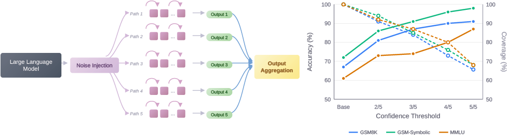

# NoisyCoconut

**Counterfactual Consensus via Latent Space Reasoning**



[](LICENSE)

NoisyCoconut is a training-free inference-time method that enhances large language model (LLM) reliability by injecting controlled noise into latent representations to generate diverse reasoning paths. Agreement among these paths provides a confidence signal, enabling models to abstain when uncertain and achieve effective coverage-accuracy tradeoffs.

## Key Features

- **No Retraining Required**: Operates directly on model representations during inference
- **Coverage-Accuracy Tradeoffs**: Enables selective prediction through agreement-based confidence estimation
- **Significant Error Reduction**: Unanimous agreement among noise-perturbed paths reduces error rates from 40–70% to below 15%
- **Model Agnostic**: Works across multiple LLM architectures (Qwen, Llama, Mixtral, DeepSeek, GPT-oss)

## How It Works

1. **Noise Injection**: Sample random noise from a Gaussian distribution and inject it into the last hidden layer of the first forward pass
2. **Path Generation**: Create K diverse reasoning paths from a common initial state
3. **Output Aggregation**: Use majority voting to produce a consensus output or abstain when paths disagree


## Installation

```bash
git clone https://github.com/your-username/noisycoconut.git
cd noisycoconut
pip install -r requirements.txt

Requirements

    Python >= 3.8
    PyTorch >= 2.0
    Transformers >= 4.35

Quick Start

python quick_branch_test.py                           # Use default config.yaml
python quick_branch_test.py --config my_config.yaml   # Custom config file
python quick_branch_test.py experiment.num_questions=50  # CLI overrides

# Download all benchmarks to ./data
python data.py

# Download to a specific directory
python data.py --data-dir ~/data/benchmarks

# Download only specific benchmarks
python data.py --benchmarks gsm8k mmlu

# Force redownload existing files
python data.py --force

# Show stats about downloaded data
python data.py --stats

from noisy_coconut import NoisyCoconut

# Initialize with your model
model = NoisyCoconut(
    model_name="Qwen/Qwen2.5-7B-Instruct",
    num_paths=5,           # K reasoning paths
    noise_scale=0.2,       # σ_0
    max_latent_steps=8     # Maximum thinking steps
)

# Run inference with confidence estimation
result = model.generate(
    prompt="What is 15% of 80?",
    confidence_threshold="4/5"  # Require 4/5 agreement
)

print(f"Answer: {result.answer}")
print(f"Confidence: {result.agreement_level}")
print(f"Abstain: {result.abstain}")

Configuration
Key Hyperparameters
Parameter	Default	Description

num_paths

(K)	5	Number of reasoning paths to generate

noise_scale

(σ₀)	0.2	Initial noise scale (ratio of noise norm to hidden state norm)

decay_rate

(λ)	1.0	Exponential decay rate for noise

max_latent_steps

	8	Maximum continuous latent thinking steps

ema_alpha

(α)	0.9	EMA coefficient for adaptive noise scaling
Confidence Thresholds

    Unanimous (5/5): Highest accuracy, lowest coverage
    Strong Majority (4/5): High accuracy with moderate coverage
    Moderate Majority (3/5): Balanced tradeoff
    Minimal Plurality (2/5): Higher coverage, lower accuracy

We evaluate on three benchmarks:

    GSM8K: Grade-school math word problems
    GSM-Symbolic: Symbolic variant of GSM8K
    MMLU: Massive Multitask Language Understanding

from noisy_coconut import NoisyCoconut

model = NoisyCoconut("Qwen/Qwen2.5-7B-Instruct")

# Single query
result = model.generate("Solve: 2x + 5 = 15")

Batch Evaluation

from noisy_coconut import NoisyCoconut, evaluate_benchmark

model = NoisyCoconut("Qwen/Qwen2.5-7B-Instruct")

# Evaluate on GSM8K
results = evaluate_benchmark(
    model=model,
    benchmark="gsm8k",
    num_samples=1000,
    confidence_thresholds=["2/5", "3/5", "4/5", "5/5"]
)

# Print coverage-accuracy tradeoff
for threshold, metrics in results.items():
    print(f"{threshold}: Accuracy={metrics['accuracy']:.1%}, Coverage={metrics['coverage']:.1%}")

Custom Noise Configuration

model = NoisyCoconut(
    model_name="Qwen/Qwen2.5-7B-Instruct",
    num_paths=10,
    noise_scale=0.3,
    decay_rate=0.5,
    adaptive_noise=True
)

Project Structure

noisy-coconut/
├── noisy_coconut/
│   ├── __init__.py
│   ├── model.py           # Main NoisyCoconut class
│   ├── noise.py           # Noise injection utilities
│   ├── aggregation.py     # Output aggregation strategies
│   └── utils.py           # Helper functions
├── scripts/
│   ├── evaluate.py        # Benchmark evaluation
│   └── noise_analysis.py  # Noise-accuracy characterization
├── configs/
│   └── default.yaml       # Default configurations
├── tests/
├── requirements.txt
└── README.md

Reproducing Paper Results
Noise-Accuracy Characterization (Section 4.2)

python scripts/noise_analysis.py \
    --model Qwen/Qwen2.5-7B-Instruct \
    --noise_scales 0.1 0.2 0.5 1.0 2.0 5.0 10.0 20.0 50.0 \
    --benchmark gsm8k

Main Experiments (Section 4.3)

python scripts/evaluate.py \
    --model Qwen/Qwen2.5-7B-Instruct \
    --benchmarks gsm8k gsm_symbolic mmlu \
    --num_paths 5 \
    --noise_scale 0.2 \
    --num_samples 1000

Limitations

    Open-weight models only: Requires access to internal model states
    Computational overhead: Generates K paths per query (linear scaling)
    Discrete responses: Best suited for tasks with well-defined answer agreement
    Architecture sensitivity: Some models (e.g., gpt-oss-20B) require modified configurations

Citation

@article{anonymous2025noisycoconut,
  title={NoisyCoconut: Counterfactual Consensus via Latent Space Reasoning},
  author={Anonymous},
  journal={Transactions on Machine Learning Research},
  year={2025}
}

License

This project is licensed under the MIT License - see the LICENSE file for details.

Acknowledgments

This work builds on the Continuous Chain-of-Thought (Coconut) framework from Hao et al. (2025).