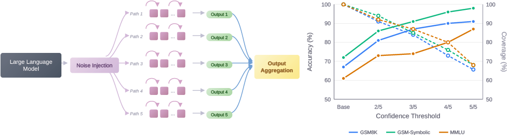

# NoisyCoconut

**Counterfactual Consensus via Latent Space Reasoning**



[](LICENSE)

NoisyCoconut is a training-free inference-time method that enhances large language model (LLM) reliability by injecting controlled noise into latent representations to generate diverse reasoning paths. Agreement among these paths provides a confidence signal, enabling models to abstain when uncertain and achieve effective coverage-accuracy tradeoffs.

## Key Features

- **No Retraining Required**: Operates directly on model representations during inference
- **Coverage-Accuracy Tradeoffs**: Enables selective prediction through agreement-based confidence estimation
- **Significant Error Reduction**: Unanimous agreement among noise-perturbed paths reduces error rates from 40-70% to below 15%
- **Model Agnostic**: Works across multiple LLM architectures (Qwen, Llama, Mixtral, DeepSeek, GPT-oss)

## How It Works

1. **Shared Forward Pass**: Run the LLM forward pass on the input to produce an initial hidden state h_0.
2. **Per-Branch Noise Injection**: Draw K independent noise vectors eta_1, ..., eta_K ~ N(0, sigma^2 * I) and add each to h_0, producing K distinct perturbed hidden states h_0^(i) = h_0 + eta_i (Eq. 1). Each branch receives its own unique perturbation — this is what causes paths to diverge.
3. **Latent Reasoning**: For each of the K perturbed variants, run the remaining T latent reasoning steps through the model's hidden states (Eq. 1–4).
4. **Path Diversity**: Pairwise trajectory diversity D_K (Eq. 5) measures how much the K paths diverged. Higher D_K indicates the paths explored meaningfully different regions of the solution space.
5. **Output Aggregation**: Decode each of the K paths autoregressively, then use majority voting to produce a consensus answer or abstain when agreement is insufficient (Eq. 6).

### Path Diversity Metric (D_K)

D_K quantifies how distinct the K reasoning trajectories are:

```
D_K = (2 / K(K-1)) * sum_{i<j} (1/T) * sum_{t=0}^{T-1} ||h_t^(i) - h_t^(j)||_2
```

A value of 0.0 means all branches collapsed to identical paths (no diversity). Higher values indicate the noise successfully induced genuinely different reasoning trajectories, which is required for agreement-based confidence estimation to be meaningful.

## Installation

```bash
git clone https://github.com/mmjerge/noisycoconut.git
cd noisycoconut
pip install -r requirements.txt
```

### Requirements

- Python >= 3.8
- PyTorch >= 2.5
- Transformers >= 4.46
- CUDA-compatible GPU (recommended)

## Quick Start

### Download Benchmark Datasets

```bash
# Download all benchmarks (GSM8K, GSM-Symbolic, MMLU) to ./data
python data.py

# Download to a specific directory
python data.py --data-dir ~/data/benchmarks

# Download only specific benchmarks
python data.py --benchmarks gsm8k mmlu

# Force redownload existing files
python data.py --force

# Show stats about downloaded data
python data.py --stats
```

### Run Experiments

```bash
# Run with default configuration (args/noisy-coconut.yaml)
python run.py --config args/noisy-coconut.yaml

# Override configuration via CLI
python run.py --config args/noisy-coconut.yaml experiment.num_questions=50

# Run with custom config file
python run.py --config my_config.yaml
```

## Configuration

Configuration is managed via YAML files. The default configuration is in `args/noisy-coconut.yaml`:

```yaml
benchmark: "gsm8k"  # Options: "gsm8k", "gsm-symbolic", "mmlu"

model:
  name: "Qwen/Qwen2.5-7B-Instruct"
  max_new_tokens: 2056

experiment:
  num_questions: 1000
  num_branches: 5       # K reasoning paths
  random_seed: 42

noise:
  scales: [0.2]         # Noise scale values to test
  type: "gaussian_scaled"  # Noise type
  direction: null       # Direction for targeted noise

sampling:
  temperature: 0.7
  top_p: 0.9

checkpoint:
  interval: 100         # Save progress every N questions

output_dir: "~/results"
```

### Noise Types

| Type | Description |
|------|-------------|
| `gaussian` | Standard Gaussian noise N(0, scale^2) |
| `gaussian_scaled` | Gaussian noise scaled to match hidden state norm |
| `snr` | Signal-to-Noise Ratio based noise |
| `uniform` | Uniform noise in [-scale, scale] |
| `orthogonal` | Noise orthogonal to hidden state direction |
| `targeted` | Noise in the direction of hidden state (amplifies/dampens) |
| `dropout` | Randomly zero out elements with probability = scale |

### Confidence Thresholds

- **Unanimous (5/5)**: Highest accuracy, lowest coverage
- **Strong Majority (4/5)**: High accuracy with moderate coverage
- **Moderate Majority (3/5)**: Balanced tradeoff
- **Minimal Plurality (2/5)**: Higher coverage, lower accuracy

## Benchmarks

We evaluate on three benchmarks:

- **GSM8K**: Grade-school math word problems
- **GSM-Symbolic**: Symbolic variant of GSM8K
- **MMLU**: Massive Multitask Language Understanding

## Project Structure

```
noisycoconut/
├── coconut.py              # Core Coconut model with noise injection
├── run.py                  # Main experiment runner with branching & voting
├── data.py                 # Dataset downloading and processing utilities
├── requirements.txt        # Python dependencies
├── args/
│   └── noisy-coconut.yaml  # Default configuration
├── scripts/
│   ├── run_experiment.sh   # SLURM job script for HPC clusters
│   ├── run_simple_experiment.sh
│   └── run_branch_experiment.sh
├── tests/
│   └── tests.py            # Comprehensive pytest test suite
├── results/                # Experiment outputs
└── assets/                 # Diagrams and images
```

## Core Components

### Coconut Model (`coconut.py`)

The `Coconut` class wraps a base causal language model and implements continuous latent reasoning:

- **Latent Tokens**: Special `<|latent|>`, `<|start-latent|>`, and `<|end-latent|>` tokens mark reasoning regions
- **TRUE METHOD**: When start/end markers are adjacent, automatically performs 8 latent reasoning passes in continuous hidden state space
- **Noise Injection**: `apply_noise_to_hidden_states()` supports multiple noise distributions
- **Branching Generation**: `generate_with_branching()` creates K diverse paths with noise applied at a specified latent step

### Experiment Runner (`run.py`)

Handles the full experimental pipeline:
- Model setup with special token registration
- Benchmark dataset loading (GSM8K, GSM-Symbolic, MMLU)
- Branching generation with configurable noise
- Answer extraction and majority voting
- Checkpoint/resume support for long experiments
- Results aggregation and accuracy reporting

### Data Utilities (`data.py`)

Provides dataset downloading and preprocessing:
- Automatic download from HuggingFace datasets
- Consistent JSON format for all benchmarks
- Custom collation for latent token padding

## Running on HPC Clusters

For SLURM-based clusters, use the provided script:

```bash
sbatch scripts/run_experiment.sh
```

The script configures:
- Multi-GPU support (4x A100)
- Mixed precision (fp16)
- Automatic checkpoint resume
- Log file management

## Running Tests

```bash
# Run all tests
pytest tests/tests.py -v

# Run specific test class
pytest tests/tests.py::TestApplyNoiseToHiddenStates -v

# Run with coverage
pytest tests/tests.py --cov=coconut
```

## Limitations

- **Open-weight models only**: Requires access to internal model states
- **Computational overhead**: Generates K paths per query (linear scaling)
- **Discrete responses**: Best suited for tasks with well-defined answer agreement
- **Architecture sensitivity**: Some models (e.g., gpt-oss-20B) require modified configurations

## Citation

```bibtex
@article{anonymous2025noisycoconut,
  title={NoisyCoconut: Counterfactual Consensus via Latent Space Reasoning},
  author={Anonymous},
  journal={Transactions on Machine Learning Research},
  year={2025}
}
```

## License

This project is licensed under the MIT License - see the [LICENSE](LICENSE) file for details.

## Acknowledgments

This work builds on the Continuous Chain-of-Thought (Coconut) framework from Hao et al. (2025).
